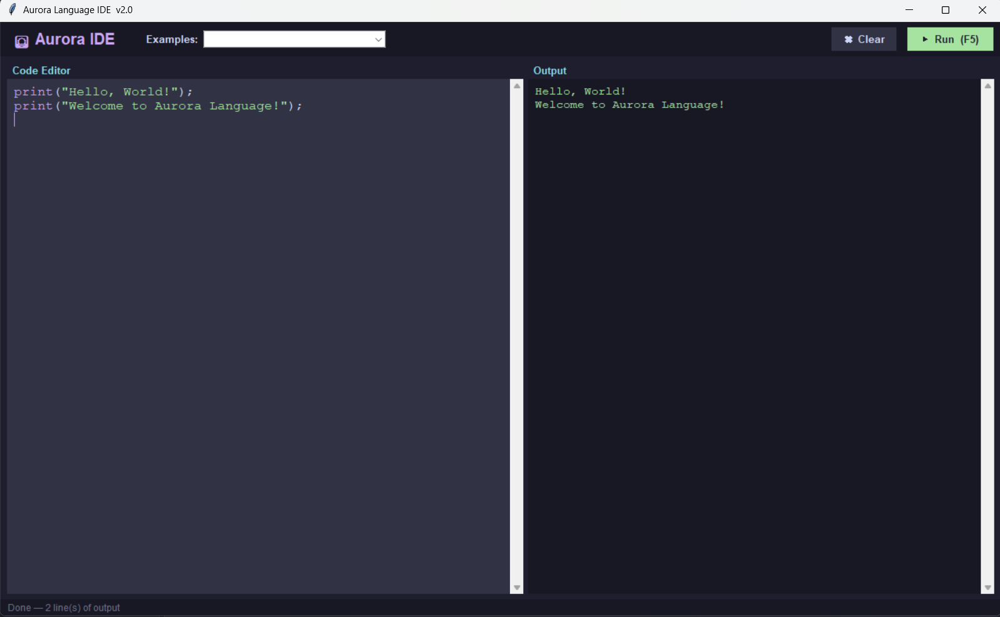

**[▶ Try Aurora in your browser](https://jatanmehta19.github.io/Aurora/)** — runs entirely client-side. No install, no signup.

# Aurora Language

[](https://github.com/JatanMehta19/Aurora_Full_Build/actions/workflows/tests.yml)
[](https://www.python.org/downloads/)
[](LICENSE)
[](#getting-started)

> A fully interpreted, type-annotated programming language with runtime-enforced type checking, built from scratch in Python.

Aurora is a custom programming language featuring a hand-written lexer, recursive-descent parser, AST-based interpreter, and a built-in dark-themed IDE — all implemented in pure Python with zero external dependencies.

Variables, function parameters, and return values carry declared types (`Int`, `Float`, `String`, `Bool`, `List`, `Map`, or inferred `auto`). Because Aurora is a tree-walking interpreter, these types are **enforced at runtime** — mismatches at declaration, reassignment, argument passing, or return raise a clear error rather than being caught by a separate compile step.

---

## Features

| Feature | Syntax |
|---|---|
| Typed variables | `Int x = 5;` `Float pi = 3.14;` `String s = "hi";` `Bool b = true;` |
| Mutable variables | `Int mut count = 0;` then `count := count + 1;` |
| Type inference | `auto x = someValue;` |
| Null | `auto x = null;` |
| Arithmetic | `+` `-` `*` `/` `%` with correct precedence |
| Comparison | `==` `!=` `<` `<=` `>` `>=` |
| Logical | `and` `or` `not` |
| String ops | Concatenation with `+`, `.upper()`, `.lower()`, `.split()`, `.len()`, `.contains()` |
| Lists | `List mut nums = [1, 2, 3];` — `.push()`, `.pop()`, `.len()`, `.contains()`, index access/assign |
| Maps | `Map mut m = {"key": "value"};` — `.keys()`, `.values()`, `.contains()`, key access/assign |
| If / Else | `if` / `else if` / `else` blocks |
| While loop | `while condition { ... }` |
| For loop | `for item in list { ... }` or `for i in 1..10 { ... }` |
| Break | `break;` inside loops |
| Functions | `func name(Type param): ReturnType { ... }` |
| Recursion | Fully supported — factorial, fibonacci, etc. |
| Classes | `class Dog { func init(...) { self.name := name; } }` |
| Built-ins | `print()` `len()` `type()` `str()` `int()` `float()` `bool()` |
| Error handling | Meaningful runtime errors with line numbers |
| Comments | `// single-line comments` |

### Not yet implemented

- **Modules** — `import moduleName;` is recognized by the lexer and parser, but
  module resolution is not implemented: the interpreter currently acknowledges
  the statement and continues without loading anything.

---

## Project Structure

```
aurora/
├── aurora.py          # CLI entry point
├── gui.py             # Tkinter IDE
├── src/
│   ├── lexer.py       # Tokenizer — converts source text into tokens
│   ├── ast_nodes.py   # AST node dataclasses
│   ├── parser.py      # Recursive-descent parser — builds AST from tokens
│   ├── environment.py # Scoped variable environment
│   └── interpreter.py # Tree-walking interpreter — executes the AST
├── examples/          # 12 sample programs (.aur)
│   ├── hello.aur          datatypes.aur    control.aur
│   ├── functions.aur      classes.aur      errors.aur
│   ├── fizzbuzz.aur       collections.aur  strings.aur
│   └── loops.aur          nested.aur       mutability.aur
└── tests/             # pytest suite (dev-only)
```

---

## Getting Started

**Requirements:** Python 3.8+ (no external libraries needed)

### Run the IDE
```bash
python gui.py
```
The IDE opens with syntax highlighting, an example dropdown, and a Run button (or press **F5**).

### Run a file from the terminal
```bash
python aurora.py examples/hello.aur
python aurora.py examples/fizzbuzz.aur
```

---

## Running Tests

The language itself has **zero runtime dependencies**. Tests use
[pytest](https://pytest.org), which is a **dev-only** dependency:

```bash
pip install -r requirements-dev.txt   # installs pytest only
python -m pytest                       # run the whole suite
```

The suite (`tests/`) covers:

- **Golden output** — every program in `examples/` is run in-process and its
  stdout is compared against a committed snapshot in `tests/golden/`.
- **Lexer** — token types, `//` comments, string escapes, and lexical errors.
- **Parser** — operator-precedence AST shape and `ParseError` line numbers.
- **Interpreter** — closures, immutability, division/modulo by zero,
  out-of-bounds indexing, undefined variables/properties, and recursion.
- **Type soundness** — wrong-type reassignment, arguments, and return values
  are rejected at runtime.

---

## 📝 Language Examples

### Hello World
```
print("Hello, World!");
```

### Variables & Types
```
Int    age     = 25;
Float  pi      = 3.14159;
String name    = "Aurora";
Bool   awesome = true;
auto   mystery = null;
```

### Control Flow
```
Int score = 87;
if score >= 90 {
    print("A");
} else if score >= 80 {
    print("B");
} else {
    print("C");
}
```

### Loops
```
// While loop
Int mut i = 1;
while i <= 5 {
    print(str(i));
    i := i + 1;
}

// For loop over a range
for n in 1..10 {
    print(str(n));
}

// For loop over a list
List fruits = ["apple", "banana", "cherry"];
for fruit in fruits {
    print(fruit);
}
```

### Functions & Recursion
```
func factorial(Int n): Int {
    if n <= 1 { return 1; }
    return n * factorial(n - 1);
}

print(str(factorial(10)));  // 3628800
```

### Classes
```
class Dog {
    func init(String name) {
        self.name   := name;
        self.tricks := [];
    }
    func learnTrick(String trick) {
        self.tricks.push(trick);
    }
    func showTricks() {
        print(self.name + " knows: " + str(self.tricks));
    }
}

auto rex = Dog("Rex");
rex.learnTrick("sit");
rex.learnTrick("fetch");
rex.showTricks();
// Rex knows: [sit, fetch]
```

### Lists & Maps
```
List mut scores = [95, 87, 73];
scores.push(100);
scores[0] := 99;
print(str(scores));

Map mut user = {"name": "Alice", "age": 30};
user["city"] := "New York";
print(str(user.keys()));
```

---

## How It Works

Aurora is implemented as a classic **interpreter pipeline**:

```
Source Code
    ↓
[Lexer]         → Converts characters into a stream of Tokens
    ↓
[Parser]        → Builds an Abstract Syntax Tree (AST) using recursive descent
    ↓
[Interpreter]   → Tree-walks the AST and executes each node
```

- **Lexer** (`src/lexer.py`) — Scans source text character by character, recognizes 40+ token types including keywords, literals, operators, and delimiters.
- **Parser** (`src/parser.py`) — Recursive-descent parser that enforces grammar rules and operator precedence (`or → and → not → == → < > → + - → * / % → unary → call`).
- **AST Nodes** (`src/ast_nodes.py`) — 25+ dataclasses representing every construct in the language.
- **Environment** (`src/environment.py`) — Scoped variable store that supports mutability, closures, and block scoping.
- **Interpreter** (`src/interpreter.py`) — Walks the AST and evaluates each node. Handles type checking, function calls, class instantiation, and built-in methods.

### Error messages

Every AST node carries the source line it was parsed from, so lexer, parser, and
runtime errors all report a location:

```
[Line 4] Runtime Error: Index 5 out of bounds (len=3)
[Line 4] Runtime Error: 'add' expects 2 args, got 1
[Line 3] Runtime Error: Type error: 'x' declared as Int but got String
```

Errors are attributed to the code that caused them rather than the code that
defines it — a wrong argument count points at the **call site**, not at the
function declaration, while a bad return value points at the function.

---

## IDE Screenshot



The built-in IDE features:
- Syntax highlighting (keywords, strings, numbers, comments)
- Example program dropdown (12 built-in examples)
- Dark Catppuccin Mocha theme
- Run button / F5 shortcut
- Error output highlighted in red

---

## Browser Playground

**[Try Aurora in your browser](https://jatanmehta19.github.io/Aurora/)** — the same
interpreter, compiled to WebAssembly with [Pyodide](https://pyodide.org) and running
entirely in the page. No server executes your code, and nothing is installed.

The playground loads `src/` unmodified. The CLI, the Tkinter IDE, the test suite, and the
web page are all consumers of the same `run_source(source, output_fn)` entry point, so
porting to the browser required no changes to the language implementation. All 12 bundled
examples produce output byte-identical to the committed snapshots in `tests/golden/`.

**Known limitation:** the interpreter runs on the browser's main thread, so an infinite
loop (`while true { }`) freezes the tab until you close it. Moving Pyodide into a Web
Worker would make a Stop button possible; that isn't implemented yet.

---

## License

Released under the [MIT License](LICENSE).

---

## Repository Metadata

**Description:**
> An interpreted programming language with typed variables, runtime type checking, classes, and a built-in Tkinter IDE — hand-written lexer, parser, and tree-walking interpreter in pure Python, zero dependencies

**Topics:**
`programming-language` · `interpreter` · `lexer` · `parser` · `tree-walking-interpreter` · `ast` · `language-design` · `python` · `tkinter` · `repl` · `education` · `no-dependencies`
